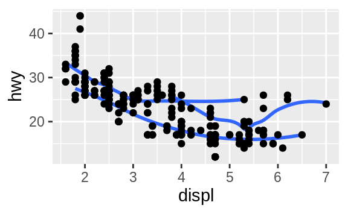
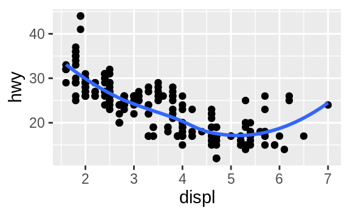
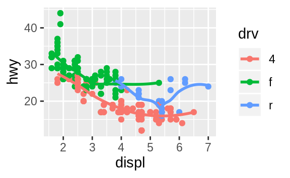
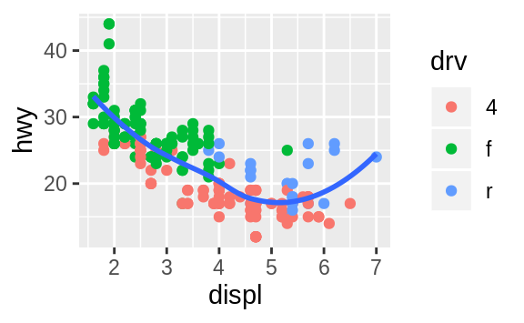
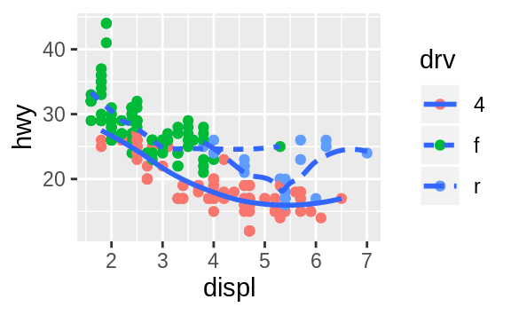
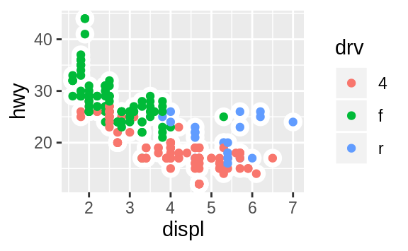

```{r setup, include = FALSE, message = FALSE}
knitr::opts_chunk$set(collapse = TRUE)
library(tidyverse)
```

## R for Data Science: Chapter 3.6 "Geometric Objects"

### [Excercises](https://r4ds.had.co.nz/data-visualisation.html#exercises-3)

#### Excercise 1

1. What geom would you use to draw a line chart? A boxplot? A histogram? An area chart?

**Answer:** To draw a line chart, use `geom_line()`. To draw a boxplot, use `geom_boxplot()`. To draw a histogram, use `geom_histogram()`. To draw an area chart, use `geom_area()`.

#### Excercise 2

2. Run this code in your head and predict what the output will look like. Then, run the code in R and check your predictions.

```{r, eval=FALSE}
ggplot(data = mpg, mapping = aes(x = displ, y = hwy, color = drv)) + 
  geom_point() + 
  geom_smooth(se = FALSE)
```

**Answer:** This plot will have two geoms, a scatterplot with engine displacement on the x-axis and highway fuel efficiency on the y-axis, and the color of the point will be based on the drive-train. On top of this will be a smoothed general trend line of the relationship between engine displacement and highway fuel efficiency broken down by drive-train with no standard error bars. 

```{r, echo=FALSE}
ggplot(data = mpg, mapping = aes(x = displ, y = hwy, color = drv)) + 
  geom_point() + 
  geom_smooth(se = FALSE)
```

#### Excercise 3

3. What does `show.legend = FALSE` do? What happens if you remove it? Why do you think I used it earlier in the chapter?

**Answer:** `show.legend = FALSE` removes a legend from a plot. If you remove this from the code of a plot, it will include the legend. The author used it earlier in the chapter as you had already explained the color groups on the plot and to keep the visualization as clean and slim as possible. 

#### Excercise 4

4. What does the `se` argument to `geom_smooth()` do?

**Answer:** The `se` argument includes a confidence interval around the smoothed trend line. By default, it is set to `TRUE` with a 95% confidence interval. The argument `level` can control the size of the confidence interval (0-1). 

#### Excercise 5

5. Will these two graphs look different? Why/why not?

```{r, eval=FALSE}
ggplot(data = mpg, mapping = aes(x = displ, y = hwy)) + 
  geom_point() + 
  geom_smooth()

ggplot() + 
  geom_point(data = mpg, mapping = aes(x = displ, y = hwy)) + 
  geom_smooth(data = mpg, mapping = aes(x = displ, y = hwy))
```

**Answer:** These plots will look the same. Geoms will look up in order to find data or mappings. If each geom uses the same data and mappings, it can be included in the `ggplot()` function call. 

#### Excercise 6

6. Recreate the R code necessary to generate the following graphs.

```{r image_grobs, fig.show = "hold", out.width = "50%", fig.align = "default", echo=FALSE}






```

```{r}
ggplot(data = mpg, mapping = aes(x = displ, y = hwy, group = drv)) + 
  geom_smooth(size = 3, se = FALSE) + 
  geom_point(size = 6)
```

```{r}
ggplot(data = mpg, mapping = aes(x = displ, y = hwy)) + 
  geom_point(size = 6) + 
  geom_smooth(size = 3, se = FALSE)
  
```

```{r}
ggplot(data = mpg, mapping = aes(x = displ, y = hwy, color = drv)) + 
  geom_point(size = 6) +
  geom_smooth(size = 3, se = FALSE)

```

```{r}
ggplot(data = mpg, mapping = aes(x = displ, y = hwy)) + 
  geom_point(mapping = aes(color = drv), size = 6) + 
  geom_smooth(size = 3, se = FALSE)
```

```{r}
ggplot(data = mpg, mapping = aes(x = displ, y = hwy)) + 
  geom_point(mapping = aes(color = drv), size = 6) + 
  geom_smooth(mapping = aes(lty = drv), se = FALSE, size = 3)
```

```{r}
ggplot(data = mpg, mapping = aes(x = displ, y = hwy)) + 
  geom_point(size = 12, color = "white") +
  geom_point(mapping = aes(color = drv), size = 6)
```